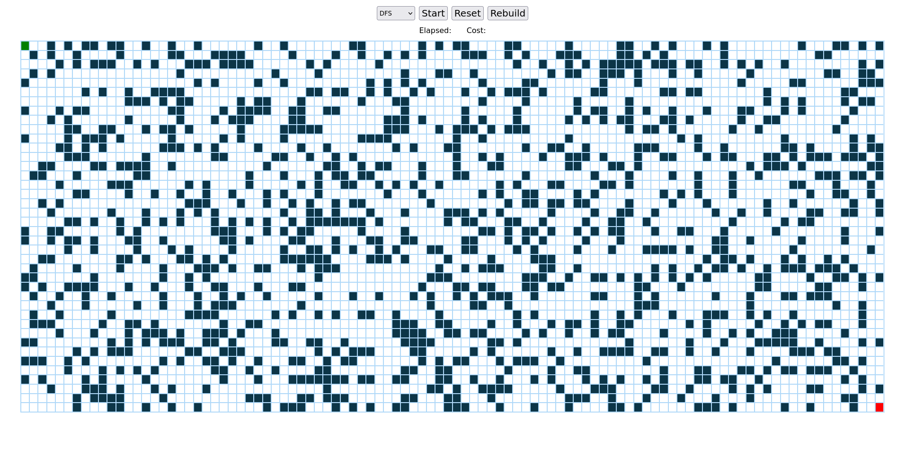

# pathfinding

A simple visualizer for commonly used pathfinding algorithms for educational purposes, and because I was bored. The project is built in vanilla JS and CSS, no fancy tech or UI, just a simple grid and some buttons.

## Algorithms available

- Dijkstra
- A\*
- BFS
- DFS

## TODO

- Add more algorithms
- Add maze generation algorithms
- Interactive maze generation
